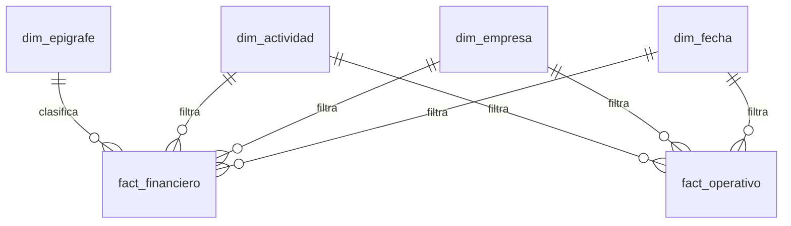

# Modelo de Costos Unitarios — Power BI + BigQuery

**Sector del cliente:** Servicios industriales / gestión ambiental y utilities
**Rol:** Modelado de datos, DAX, migración de lógica de negocio desde SQL legacy

> ℹ️ Proyecto real para un cliente corporativo. Nombres de cliente, cifras y datos operativos **no se muestran** por confidencialidad — este caso de estudio describe la arquitectura y las técnicas aplicadas.

## Contexto y problema

El cliente calculaba costos unitarios (costo por unidad de actividad operativa) con una vista SQL monolítica: una subconsulta base repetida 8 veces, ramas de fecha calculadas a mano (`date_add` +2/+11 meses), columnas de acumulados pre-calculadas con funciones de ventana, y una unión manual (`UNION ALL`) para unificar sedes que duplicaba montos si no se aplicaba con cuidado. Cada cambio de regla de negocio implicaba editar SQL de cientos de líneas y regenerar la vista completa.

El objetivo fue reemplazar esa lógica por un modelo semántico en Power BI, manteniendo la trazabilidad con la fuente contable/operativa en BigQuery.

## Arquitectura



Esquema en estrella con **dos tablas de hechos que nunca se unen directamente entre sí** (financiero y operativo/driver) — se relacionan únicamente a través de las dimensiones compartidas (fecha, empresa, actividad). El costo unitario se calcula siempre como medida DAX (`Costo Financiero / Driver Operativo`), nunca como columna precalculada.

## Qué se reemplazó (de SQL a modelo semántico)

| Antes (vista SQL) | Ahora (Power BI) |
|---|---|
| Subconsulta base repetida 8 veces | 1 tabla de hechos, reutilizada por todas las medidas |
| Ramas de fecha con offsets manuales (`date_add`) | Jerarquía de calendario + `TOTALYTD` |
| Columnas de acumulado con funciones de ventana | Medidas DAX con contexto de filtro dinámico |
| Bloque de relleno de ceros (cross join) | Innecesario — el modelo relacional agrega correctamente |
| División protegida hardcodeada por fila | `DIVIDE()` a nivel de medida |
| `UNION ALL` para unificar sedes (riesgo de duplicar montos) | Mapeo declarativo en la dimensión de empresa |

## Técnicas destacadas

**Asignación de costos comunes (overhead) por peso de actividad**, reescrita como cascada de medidas DAX en vez de una fórmula SQL de una sola línea:

```dax
-- Peso de cada actividad = costos propios de la actividad / ingresos totales de la empresa
Driver Asignación =
    DIVIDE(
        CALCULATE( [Costos YTD], dim_actividad[grupo] <> "COMUN" ),
        [Ingresos Empresa YTD]
    )

-- El overhead común se reparte usando ese peso, no una regla fija
Overhead Asignado YTD = [Costos Comunes YTD] * [Driver Asignación]

Costo Unitario + OH =
    DIVIDE(
        [Costos Propios YTD] + [Overhead Asignado YTD],
        [Driver Operativo YTD]
    )
```

**Estrategia de carga:** modo Import (no DirectQuery) para un volumen de ~13M de filas, con actualización incremental planificada sobre la columna de fecha del hecho financiero (archivar histórico, refrescar solo los últimos meses) para mantener el refresh en segundos en lugar de minutos.

## Stack técnico
`Power BI (PBIP/TMDL)` · `DAX` · `BigQuery (conector nativo)` · `SQL` · `Modelado dimensional`

## Resultado
Modelo mantenible donde una nueva regla de negocio se implementa como una medida DAX adicional (auditable, con dependencias explícitas) en vez de reescribir una vista SQL completa; el costo unitario responde correctamente a cualquier combinación de filtros (empresa, actividad, período) sin lógica duplicada.
