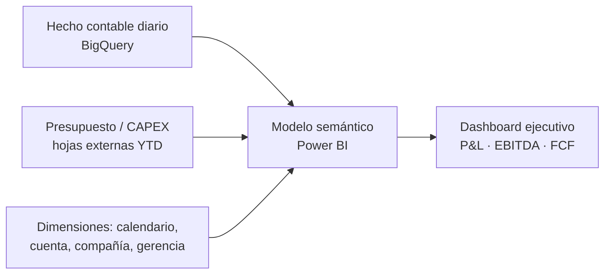

# Data Hub Financiero (LATAM) — Auditoría de Modelo DAX y Dashboard Ejecutivo

**Sector del cliente:** Corporativo multinacional, operación LATAM
**Rol:** Auditoría de modelo semántico, corrección de medidas DAX, diseño de dashboard ejecutivo

> ℹ️ Proyecto real para un cliente corporativo. Nombres de cliente, cifras financieras y estructura de cuentas **no se muestran** por confidencialidad — este caso de estudio describe la metodología de auditoría y las técnicas aplicadas.

## Contexto y problema

Un dashboard financiero ejecutivo (P&L, EBITDA, EBIT, flujo de caja libre) combinaba una tabla de hechos contable detallada (conectada a BigQuery, granularidad diaria) con hojas de cálculo externas pre-agregadas (CAPEX y capital de trabajo, en formato YTD). El tablero mostraba cifras a gerencia, pero nadie había auditado formalmente la consistencia de las medidas DAX contra la convención contable real de la fuente.

Se hizo una auditoría completa del modelo semántico (`.tmdl`) para validar signos contables, alcance de filtros y consistencia entre las fuentes antes de que el dashboard llegara a comité directivo.

## Metodología de auditoría

1. **Trazar la convención de signo de la fuente** (¿ingresos en crédito o débito?) y verificar que cada medida derivada la respete en cascada.
2. **Revisar filtros de negocio** de cada medida base contra la definición documentada (¿filtra correctamente solo el libro contable "real" y las cuentas de P&L, o se cuela información de balance/intercompañía?).
3. **Detectar listas de cuentas hardcodeadas** dentro de las medidas DAX — cualquier cuenta nueva que el área contable agregue queda automáticamente excluida del cálculo si nadie actualiza el DAX.
4. **Cruzar fuentes de distinta granularidad** (hecho diario vs. hoja YTD anual) y confirmar si el dashboard comunica correctamente cuáles bloques respetan el segmentador de mes y cuáles son una foto fija anual.
5. **Construir una medida de validación cruzada** que compare la suma de los componentes contra el total general — si la diferencia no es cero, hay cuentas sin mapear.

## Ejemplo de hallazgo (patrón, sin cifras reales)

Un error de signo típico en cascadas de medidas: si la fuente registra utilidades en signo negativo (convención de crédito contable) y una medida intermedia ya normaliza el signo, una medida posterior que vuelve a invertirlo produce **el resultado contrario al esperado exactamente cuando la empresa gana dinero** — el tipo de error que no se nota en una revisión visual porque el dashboard sigue "viéndose bien".

```dax
// Patrón defensivo aplicado: filtro explícito por concepto (KFI) en vez de
// listas de cuentas hardcodeadas, para que el modelo sea auto-mantenible
measure 'Concepto Base' =
    CALCULATE(
        SUM( fact_gl[monto] ),
        fact_gl[libro]    = "REAL",
        fact_gl[alcance]  = "PYG",
        fact_gl[concepto] = "EBIT"        -- una sola fuente de verdad, no 13 códigos sueltos
    )

// Medida de auditoría: si esto no da 0, hay cuentas sin mapear a ningún concepto
measure 'Auditoria Suma Conceptos' =
    ROUND( [Total Mapeado] - [Total General], 0 )
```

## Arquitectura del modelo



## Stack técnico
`Power BI (PBIP/TMDL)` · `DAX` · `BigQuery` · `Power Query (M)` · `Auditoría de modelos semánticos`

## Resultado
Catálogo priorizado de hallazgos (crítico/alto/medio) con la corrección DAX exacta para cada uno, medida de validación cruzada permanente en el modelo, y recomendación estructural para migrar las fuentes YTD pre-agregadas a formato largo (long) y así eliminar columnas hardcodeadas por año.
