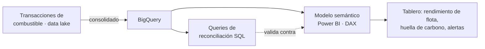

# Panel de Gestión de Flota y Combustible — Power BI + BigQuery

**Sector del cliente:** Operación logística / flota vehicular multi-región
**Rol:** Modelado de datos, cálculo de huella de carbono, validación de calidad de datos

> ℹ️ Proyecto real para un cliente corporativo. Nombres de cliente, cifras de consumo/costo y datos de flota **no se muestran** por confidencialidad — este caso de estudio describe la metodología y las técnicas aplicadas, con datos de ejemplo ficticios.

## Contexto y problema

Un cliente con flota distribuida en decenas de regiones operativas necesitaba consolidar transacciones de combustible (diésel, gasolina, gas vehicular) desde un data lake en BigQuery, calcular la huella de carbono asociada (CO₂ equivalente), y detectar vehículos con rendimiento anómalo — todo en un tablero que gerencia pudiera auditar contra la fuente original.

## Técnica destacada: cálculo de emisiones de CO₂e por tipo de combustible

Se aplicaron los **factores de emisión estándar IPCC 2006 (Scope 1)** por tipo de combustible, implementados tanto en la capa de validación SQL como en las medidas DAX del modelo, para que ambas capas coincidieran exactamente:

```sql
-- Ejemplo ilustrativo con datos ficticios — factores de emisión son públicos (IPCC 2006)
SELECT
    tipo_combustible,
    ROUND(SUM(volumen_litros), 2) AS volumen_total_l,
    ROUND(SUM(
        CASE UPPER(tipo_combustible)
            WHEN 'DIESEL'             THEN volumen_litros * 2.6981 / 1000
            WHEN 'GASOLINA CORRIENTE' THEN volumen_litros * 2.3274 / 1000
            WHEN 'GASOLINA EXTRA'     THEN volumen_litros * 2.3274 / 1000
            ELSE                           volumen_litros * 1.9635 / 1000  -- GNV
        END
    ), 4) AS co2e_toneladas
FROM transacciones_combustible
GROUP BY tipo_combustible;
```

## Metodología de validación de calidad de datos

Para poder confiar en el tablero, se construyó un proceso de **reconciliación BigQuery ↔ Power BI**: consultas SQL independientes que recalculan los mismos totales (vehículos, transacciones, costo, volumen, CO₂e) por región y los comparan contra los valores que muestra el modelo semántico, con una columna de estado automática:

```sql
-- Patrón de reconciliación (simplificado, sin datos reales)
SELECT
    COALESCE(bq.region, pbi.region)                                   AS region,
    bq.transacciones, pbi.transacciones,
    ROUND((bq.costo - pbi.costo) / NULLIF(pbi.costo, 0) * 100, 2)     AS diff_costo_pct,
    CASE
        WHEN ABS(bq.transacciones - pbi.transacciones) > 0            THEN 'DIFF TRANSACCIONES'
        WHEN ABS((bq.costo - pbi.costo) / NULLIF(pbi.costo, 0)) > 0.001 THEN 'DIFF COSTO > 0.1%'
        ELSE 'OK'
    END                                                                 AS estado
FROM bq_totales bq
FULL OUTER JOIN pbi_totales pbi USING (region);
```

También se incluyó un query de calidad de datos dedicado para cuantificar registros con campos clave faltantes (región o identificador de vehículo nulo) — insumo para priorizar limpieza en el origen antes de confiar en los KPIs agregados.

## Arquitectura



## Stack técnico
`Power BI (PBIP/TMDL)` · `DAX` · `BigQuery` · `SQL` · `Validación de calidad de datos` · `Cálculo de emisiones GEI`

## Resultado
Tablero con métricas de consumo, costo y CO₂e por región y por vehículo, respaldado por un proceso de reconciliación reproducible que permite detectar desviaciones entre la fuente y el modelo antes de que lleguen a un reporte gerencial.
